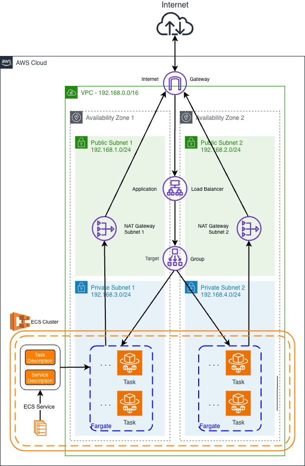

# AWS ECS Fargate Application Infrastructure

This repository contains a CloudFormation template to deploy a containerized web application on AWS ECS Fargate with a scalable and highly available architecture.

## Prerequisites

- AWS CLI installed and configured
- Docker image URL for your application
- AWS user with permission to instantiate the resources

⚠️ At this moment, please attach the `AdministratorAccess` policy to your AWS user to avoid errors during the creation of the Cloudformation Stack (i.e. permission errors).

## Deployment Steps

1. Clone this repository:
   ```bash
   git clone https://github.com/cesdias/ecs-fargate-app.git
   cd ecs-fargate-app
   ```

2. All the parameters have default values so there is no need to configure anything, but make sure to review and update parameters and configurations according to your specific requirements. Below you can find the parameters available for customization and the default values:

   - `VpcCIDR`: `192.168.0.0/16`
   - `PublicSubnet1CIDR`: `192.168.1.0/24`
   - `PublicSubnet2CIDR`: `192.168.2.0/24`
   - `PrivateSubnet1CIDR`: `192.168.3.0/24`
   - `PrivateSubnet2CIDR`: `192.168.4.0/24`
   - `ContainerImage`: `docker.io/cesdias/ecs-fargate-app:latest`

3. Run the AWS CLI command to deploy CloudFormation stack:

   ```bash
   aws cloudformation deploy \
      --template-file template.yaml \
      --stack-name ECSFargateAppStack \
      --capabilities CAPABILITY_IAM
   ```

   In case you are providing new parameters, use the option `--parameter-overrides` in the command line. Below is an example to deploy a stack settings new values for parameters:

   ```bash
      aws cloudformation deploy \
         --template-file cloudformation/ecs-fargate-template.yaml \
         --stack-name ECSFargateAppStack \
         --parameter-overrides \
           VpcCIDR="10.0.0.0/16" \
           PublicSubnet1CIDR="10.0.1.0/24" \
           PublicSubnet2CIDR="10.0.2.0/24" \
           PrivateSubnet1CIDR="10.0.3.0/24" \
           PrivateSubnet2CIDR="10.0.4.0/24" \
           ClusterSize=2 \
           ContainerImage="docker.io/nginx:latest" \
           --capabilities CAPABILITY_IAM
   ```

4. Wait for the deployment to complete. You can also check the progress using the following command:

   ```bash
   aws cloudformation describe-stacks --stack-name ECSFargateAppStack
   ```

5. Access your application using the Load Balancer DNS name provided in the CloudFormation stack outputs.

   ```bash
      aws cloudformation describe-stacks --stack-name ECSFargateAppStack --query 'Stacks[0].Outputs'
   ```

## Cleanup

To delete the CloudFormation stack, run the following command:

```bash
aws cloudformation delete-stack --stack-name ECSFargateAppStack
```

# Architecture

## Overview

The architecture depicted in the figure below shows the infrastructure for hosting a containerized application on AWS. The architecture uses the implementation of a Virtual Private Cloud (VPC), public and private subnets, security groups, an Application Load Balancer (ALB), and an Elastic Container Service (ECS) Fargate-based deployment strategy to orchestrate a robust infrastructure for a web application

The architecture below can be created on AWS using Cloudformation. You can find the Cloudformation template [here](template.yaml).



The Cloudformation script defines the architecture and its components in terms of AWS resources, creating the infrastructure following the best practices for high availability, high scalability and security. This includes also resources and configurations that are not depicted in architecture diagrams sometimes. Below is a quick description of the components and resources present in the architecture.

**Networking and Security:**
The networking layer incorporates Public Subnets (1 and 2) for the ALB and Private Subnets (1 and 2) for ECS Fargate instances. An Internet Gateway ensures connectivity for Public Subnets while the deployment of NAT Gateways to facilitate outbound traffic from private subnets also maintains the security of the Application running on ECS Fargate Tasks. Note that the Public and Private Subnets are within two Availability Zones, ensuring high-availability and fault-tolerance to the Application.

**Security Group:**
Two Security Groups were defined: the first one governs inbound traffic to the Application Load Balancer, while the second one regulates communication among Fargate containers on the ECS service.

**Load Balancing for High Availability:**
The Application Load Balancer (ALB) distribute traffic across ECS Fargate instances, ensuring high availability and fault tolerance between two AZs within the AWS Region. A Target Group is configured to health-check the instances, ensuring efficient routing and also providing the forwarding traffic to the ECS Fargate tasks.

**IAM Roles for Task Execution:**
IAM roles and policies are specified to empower ECS Fargate tasks with the necessary permissions for attaching network interfaces, updating load balancers, and other essential actions.

**ECS Cluster and Service Definition:**
The ECS Cluster and the ECS Service are responsible for orchestrating and managing the deployed Fargate instances. The service dynamically scales based on defined criteria and integrates seamlessly with the Application Load Balancer.

## Resources in use

- VPC
- InternetGateway
- NatGateway
- ElasticLoadBalancingV2
- IAM
- ECS

## Summary of the Configurations

Below is a description of the configurations present in the architecture after it is deployed. Those values and parameters are defined in the Cloudformation template.

### Connectivity Table

**Connections:**

| From               | To                 | Access         |
|--------------------|--------------------|----------------|
| 0.0.0.0/0          | ecs-fargate-app-lb | 80 tcp (HTTP)  |
| ecs-fargate-app-lb | ecs-service        | 3000 tcp (App) |

* The access from internet to the application is allowed via a Elastic Load Balancer on Port 80 (HTTP).
* The Load Balancer forwards the traffic to the Elastic Container Service on port 3000 (App Port)

### Network

**VPC**

Default network for VPC is 192.168.0.0/16. The configuration of the VPC also enables DNS support.

| Key                | Value          |
|--------------------|----------------|
| CidrBlock          | 192.168.0.0/16 |
| EnableDnsHostnames | True           |
| EnableDnsSupport   | True           |

**PublicSubnet1 (192.168.1.0/24) and PublicSubnet2 (192.168.1.0/24) Routes**

| Id          | Destination Cidr Block | Via             |
|-------------|------------------------|-----------------|
| PublicRoute | 0.0.0.0/0              | InternetGateway |

The access for Public Subnets are via InternetGateway attached to each Public Subnet (1 and 2), providing direct access to the Internet.

**PrivateSubnet1 Routes (192.168.3.0/24)**

| Id                  | Destination Cidr Block | Via               |
|---------------------|------------------------|-------------------|
| PrivateRouteSubnet1 | 0.0.0.0/0              | NatGatewaySubnet1 |

**PrivateSubnet2 Routes (192.168.4.0/24)**

| Id                  | Destination Cidr Block | Via               |
|---------------------|------------------------|-------------------|
| PrivateRouteSubnet2 | 0.0.0.0/0              | NatGatewaySubnet2 |

Private Subnets uses NAT Gateways to access Internet, one for each Subnet (1 and 2). This enables the tasks running on the ECS Service to access Internet while staying inaccessible from Internet due to how NAT Gateway operates. In this case, there is no need for Network ACLs or Firewalls.

### Container Services

**Cluster (ECS Cluster)**

| Key               | Value      |
|-------------------|------------|
| ClusterName       | ECSCluster |
| ContainerInsights | enabled    |

**Task Definition**

| Key                            | Value                |
|--------------------------------|----------------------|
| LaunchType                     | FARGATE              |
| Cluster                        | Cluster              |
| DesiredCount                   | 4                    |
| Cpu                            | 256                  |
| Memory                         | 512                  |
| Family                         | ecs-fargate-app      |
| NetworkMode                    | awsvpc               |
| TaskRoleArn                    | ECSRole              |
| ExecutionRoleArn               | ECSTaskExecutionRole |
| Subnets                        | PrivateSubnet1, PrivateSubnet2 |
| SecurityGroups                 | ECSSecurityGroup |
| ecs-fargate-app - Image        | docker.io/cesdias/ecs-fargate-app:latest |
| ecs-fargate-app - Cpu          | 256  |
| ecs-fargate-app - Memory       | 512  |
| ecs-fargate-app - Essential    | True |
| ecs-fargate-app - PortMappings | {'HostPort': 3000, 'ContainerPort': 3000, 'Protocol': 'tcp'} |
| ecs-fargate-app - Environment  | {'Name': 'AUTHOR', 'Value': 'Carlos Dias'} |
| RuntimePlatform                | {'CpuArchitecture': 'ARM64', 'OperatingSystemFamily': 'LINUX'} |

**ECS Tasks**

| Id               | Cpu   | Memory | Family          | Network Mode | Name             | Image              |
|------------------|-------|--------|-----------------|--------------|------------------|-------------------|
| TaskDefinition   | 256   | 512    | ecs-fargate-app | awsvpc        | ecs-fargate-app | docker.io/cesdias/ecs-fargate-app:latest |

⚠️ The container for the application was built using a ARM64 architecture. The Cloudformation Stack is configured to deploy ARM64 images. If you change the application image repository for other architecture (i.e. X86_64), please change the `TaskDefinition` accordingly.

**Service (ECS Service)**

| Key                    | Value                       |
|------------------------|-----------------------------|
| Cluster                | ECSCluster                  |
| ServiceName            | ecs-fargate-app-ecs-service |
| TaskDefinition         | !Ref TaskDefinition         |
| LaunchType             | FARGATE                     |
| PlatformVersion        | 1.4.0                       |
| DesiredCount           | 4                           |
| LoadBalancers          | { 'TargetGroupArn': 'TargetGroup', 'ContainerName': 'ecs-fargate-app',  'ContainerPort': '3000'} |
| NetworkConfiguration   | { 'AwsvpcConfiguration': { 'AssignPublicIp': 'DISABLED', 'SecurityGroups': 'ECSSecurityGroup', 'Subnets': { 'PrivateSubnet1', 'PrivateSubnet2'} } } |

The default number of tasks is set to 4, which means that 2 tasks with run in each Availability Zone, providing high availability.

### Application Load Balancer

**ecs-fargate-app-lb (ElasticLoadBalancingV2-LoadBalancer)**

| Key            | Value                        |
|----------------|------------------------------|
| Type           | application                  |
| Name           | ecs-fargate-app-lb           |
| Scheme         | internet-facing              |
| Subnets        | PublicSubnet1, PublicSubnet2 |
| SecurityGroups | WebAppSecurityGroup          |

**Listener (ElasticLoadBalancingV2-Listener)**

| Key                | Value                    |
|---------------------|-------------------------|
| DefaultActions      | {'Type': 'forward', 'TargetGroupArn': {'TargetGroup'}} |
| LoadBalancerArn     | ApplicationLoadBalancer |
| Port                | 80                      |
| Protocol            | HTTP                    |

**TargetGroup (ElasticLoadBalancingV2-TargetGroup)**

| Key                        | Value              |
|----------------------------|--------------------|
| VpcId                      | VPC                |
| Name                       | ecs-fargate-app-tg |
| TargetType                 | ip                 |
| Port                       | 80                 |
| Protocol                   | HTTP               |
| HealthCheckEnabled         | True               |
| HealthCheckPath            | /                  |
| HealthCheckProtocol        | HTTP               |
| HealthyThresholdCount      | 5                  |
| HealthCheckIntervalSeconds | 60                 |
| HealthCheckTimeoutSeconds  | 5                  |
| Matcher                    | {'HttpCode': 200}  |
| Tag - Name                 | ecs-fargate-app-tg |

### Security Groups:

**WebAppSecurityGroup (EC2-SecurityGroup)**

Security group for the web application.

| Key                 | Description                | Ip Protocol | Obt                 | From Port | To Port |
|---------------------|----------------------------|-------------|---------------------|-----------|---------|
| Egress              | Allow all outbound traffic | -1          | 0.0.0.0/0           |           |         |
| Ingress             | Allow HTTP inbound traffic | tcp         | 0.0.0.0/0           | 80        | 80      |

**ECSSecurityGroup (EC2-SecurityGroup)**

Security group for Fargate Containers on ECS Service

| Key                 | Description                     | Ip Protocol | Obj aaaa            | From Port | To Port |
|---------------------|---------------------------------|-------------|---------------------|-----------|---------|
| Egress              | Allow all outbound traffic      | -1          | 0.0.0.0/0           |           |         |
| Ingress             | Allow port 3000 inbound traffic | tcp         | WebAppSecurityGroup | 3000      | 3000    |

### Identify and Access Management (IAM):

**ECSTaskRole and ECSTaskExecutionRole**

There are two roles necessary for a ECS Service: ECSTaskRole and ECSTaskExecutionRole.

* ECSTaskRole: allows the tasks running on ECS to interact with other AWS resources. i.e. to apply autoscaling on EC2 instances. The following Actions are defined for the ECSRole.
   - ec2:AttachNetworkInterface
   - ec2:CreateNetworkInterface
   - ec2:CreateNetworkInterfacePermission
   - ec2:DeleteNetworkInterface
   - ec2:DeleteNetworkInterfacePermission
   - ec2:Describe*
   - ec2:DetachNetworkInterface
   - elasticloadbalancing:DeregisterInstancesFromLoadBalancer
   - elasticloadbalancing:DeregisterTargets
   - elasticloadbalancing:Describe*
   - elasticloadbalancing:RegisterInstancesWithLoadBalancer
   - elasticloadbalancing:RegisterTargets

* ECSExecutionRole: allos the tasks running on ECS to interact with the minimum resources necessary for a task to run (Containers and Logs). The Actions defined for this role are:
   - ecr:GetAuthorizationToken
   - ecr:BatchCheckLayerAvailability
   - ecr:GetDownloadUrlForLayer
   - ecr:BatchGetImage
   - logs:CreateLogStream
   - logs:PutLogEvents

# Costing

Estimated monthly cost of the environment is $92.71 USD.

| Node               | Type        | Unit                                       | Usage         | Total      |
|--------------------|-------------|--------------------------------------------|---------------|------------|
| ecs-fargate-app-lb | application | $0.0225 per Application Load Balancer-hour | 732 hours     | $16.47     |
| ecs-fargate-app-lb | application | $0.008 per LCU-hour                        | 732 hours     | $5.86      |
| Service            | unknown     | $1 per usage                               | 0             | $0.00      |
| NatGatewaySubnet1  | Gateway     | $32.94 per gateway per month               | 1             | $32.94     |
| NatGatewaySubnet1  | GB          | $0.045 per GB data processed               | 50            | $2.25      |
| NatGatewaySubnet2  | Gateway     | $32.94 per gateway per month               | 1             | $32.94     |
| NatGatewaySubnet2  | GB          | $0.045 per GB data processed               | 50            | $2.25      |

Pricing is based on us-east-1. Pricing is in USD. This is an estimate only.

# Work In Progress (WIP)

This project is currently a work in progress. The following enhancements are planned:

1. Add CloudWatch Logs and Metrics:
   * Implement comprehensive logging and monitoring using AWS CloudWatch.
   
2. Add AutoScaling Configuration for ECSService:
   * Configure Auto Scaling for ECS Service based on application load.

3. Add HTTPS to Load Balancer:
   * SSL certificates for the Application Load Balancer managed by AWS ACM

4. Create a policy for deploy the Cloudformation Stack
   * Allow only the necessary permission on the resources
